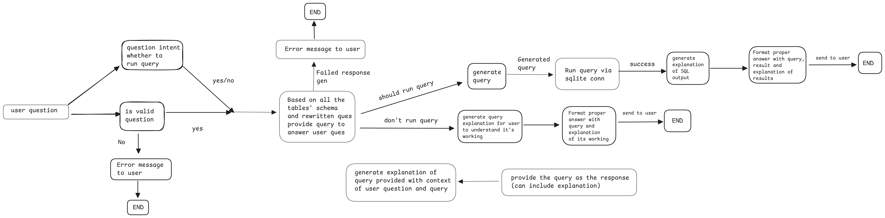

# SQL Devin

SQL Devin is a powerful tool that allows you to interact with your databases and tables using natural language. Forget about memorizing SQL syntax—just describe what you want, and SQL Devin will generate the appropriate SQL queries for you. Whether you need to create, delete, insert, update, drop, or perform any other operation on your database, SQL Devin is here to assist!

## Key Features

- **Natural Language SQL Generation**: Simply describe what you want to do (e.g., "provide me top 5 records from customer table") and SQL Devin will generate the appropriate SQL query for you along with result explanation.
- **Database Operations**: Perform read only SQL operations for analytics like `SELECT * FROM ...`
- **Query Explanation Generation**: Pass in any SQL query and ask for explanation and it will break the query and explain each part of it.

## How It Works

1. **Input your request in natural language**: Simply type in your intent, such as "Show me all employees in the Marketing department" or "Give top 5 records from music table".
2. **SQL Devin processes your request**: The system will interpret your input and generate the SQL query corresponding to your request.
3. **Error Handling**: If the query fails, SQL Devin will analyze the error, regenerate the SQL query considering the error message, and provide a corrected query automatically.

### Workflow Diagram



## Getting Started

### Prerequisites

- Python 3.7 or higher
- [Streamlit](https://streamlit.io/)
- [LangChain](https://github.com/hwchase17/langchain)
- [SQLAlchemy](https://www.sqlalchemy.org/)
- [Pandas](https://pandas.pydata.org/)

### Installation

1. Clone the repository:

   ```sh
   git clone https://github.com/VarunArora14/sql-devin.git
   cd sql-devin
   ```

2. Create a virtual environment and activate it:

   ```sh
   python -m venv venv
   source venv/bin/activate  # On Windows use `venv\Scripts\activate`
   ```

3. Install the required packages:

   ```sh
   pip install -r requirements.txt
   ```

4. Set up environment variables:
   Create a .env file in the root directory and add your API keys:

   ```sh
   HUGGINGFACEHUB_API_TOKEN=your_huggingfacehub_api_token
   GOOGLE_API_KEY=your_google_api_key
   ```

### Running the Application

1. Start the Streamlit application:

   ```sh
   streamlit run app/Welcome.py
   ```

2. Open your browser and navigate to `http://localhost:8501` to access SQL Devin.

### Example Inputs

- "Provide top 5 records from customer table"
- "provide schema of music table"
- "Explain the following query `drop table mytable;`"

## Project Structure

- `app/`: Contains the Streamlit application files.
  - `Welcome.py`: The main entry point for the Streamlit application.
  - `pages/SQL_Devin.py`: Contains the logic for generating and handling SQL queries.
- `Chinook_Sqlite.sql`: The SQL script to create and populate the Chinook database.
- `requirements.txt`: List of required Python packages.
- `.env`: Environment variables for API keys (not included in the repository).

---

Happy querying with SQL Devin!
